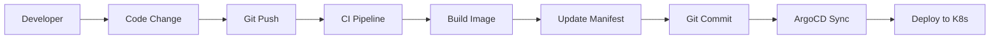

# GitOps Workflow Guide

This document explains the GitOps workflow used in this project and how to implement GitOps best practices.

## What is GitOps?

GitOps is a way of implementing Continuous Deployment for cloud-native applications. It focuses on using Git as a single source of truth for declarative infrastructure and applications.

### Core Principles

1. **Declarative**: Everything is described declaratively
2. **Versioned and Immutable**: Git provides version control and immutability
3. **Pulled Automatically**: Changes are automatically pulled and applied
4. **Continuously Reconciled**: The desired state is continuously reconciled

## GitOps Workflow

### 1. Developer Workflow



#### Steps:

1. **Code Development**: Developer makes changes to application code
2. **Git Push**: Changes are pushed to the main branch
3. **CI Pipeline**: GitHub Actions builds and tests the application
4. **Image Build**: Docker image is built and pushed to registry
5. **Manifest Update**: Kubernetes manifests are updated with new image tag
6. **Auto Sync**: ArgoCD detects changes and syncs to cluster

### 2. Traditional vs GitOps

| Traditional CI/CD | GitOps |
|------------------|--------|
| Push-based deployment | Pull-based deployment |
| CI/CD tool pushes to cluster | Agent pulls from Git |
| Cluster credentials in CI/CD | No cluster access needed |
| Hard to audit | Git provides full audit trail |
| Configuration drift possible | Continuous reconciliation |

## Implementation in This Project

### Repository Structure

```
├── .github/workflows/    # CI pipeline
├── argocd/              # ArgoCD configuration
├── dev/                 # Development environment manifests
├── staging/             # Staging environment manifests (future)
├── production/          # Production environment manifests (future)
└── src/                 # Application source code
```

### CI Pipeline (GitHub Actions)

```yaml
# .github/workflows/ci.yml
name: CI/CD Pipeline

on:
  push:
    branches: [main]

jobs:
  build:
    runs-on: ubuntu-latest
    steps:
      - name: Checkout code
      - name: Build application
      - name: Run tests
      - name: Build Docker image
      - name: Push to registry
      - name: Update manifest (optional)
```

### CD Pipeline (ArgoCD)

```yaml
# argocd/application.yaml
apiVersion: argoproj.io/v1alpha1
kind: Application
metadata:
  name: myapp-argo-application
spec:
  source:
    repoURL: https://github.com/username/repo.git
    path: dev
  destination:
    server: https://kubernetes.default.svc
    namespace: myapp
  syncPolicy:
    automated:
      selfHeal: true
      prune: true
```

## GitOps Best Practices

### 1. Repository Structure

#### Mono-repo Approach
- Single repository for application and manifests
- Suitable for small teams and simple applications

#### Multi-repo Approach
- Separate repositories for application code and manifests
- Better separation of concerns
- Suitable for large teams and complex applications

### 2. Environment Management

#### Directory-based Environments
```
├── environments/
│   ├── dev/
│   ├── staging/
│   └── production/
```

#### Branch-based Environments
- `dev` branch → Development environment
- `staging` branch → Staging environment
- `main` branch → Production environment

#### Overlay-based Environments (Kustomize)
```
├── base/
│   ├── deployment.yaml
│   └── service.yaml
└── overlays/
    ├── dev/
    ├── staging/
    └── production/
```

### 3. Automated vs Manual Sync

#### Automated Sync (Recommended for dev/staging)
```yaml
syncPolicy:
  automated:
    selfHeal: true
    prune: true
```

#### Manual Sync (Recommended for production)
```yaml
syncPolicy:
  syncOptions:
    - CreateNamespace=true
# No automated section = manual sync
```

### 4. Secret Management

#### External Secrets Operator
```yaml
apiVersion: external-secrets.io/v1beta1
kind: SecretStore
metadata:
  name: vault-backend
spec:
  provider:
    vault:
      server: "https://vault.example.com"
```

#### Sealed Secrets
```yaml
apiVersion: bitnami.com/v1alpha1
kind: SealedSecret
metadata:
  name: mysecret
spec:
  encryptedData:
    password: AgBy3i4OJSWK+PiTySYZZA9rO43cGDEQAx...
```

## Monitoring and Observability

### 1. ArgoCD Metrics

ArgoCD provides Prometheus metrics for:
- Application sync status
- Repository health
- Resource health

### 2. Application Metrics

Monitor your application with:
- Application performance metrics
- Business metrics
- Infrastructure metrics

### 3. Git Metrics

Track Git-based metrics:
- Commit frequency
- Lead time
- Deployment frequency
- Mean time to recovery

## Security Considerations

### 1. Git Repository Access

- Use SSH keys or personal access tokens
- Implement branch protection rules
- Require code reviews for critical environments

### 2. ArgoCD Security

- Enable RBAC
- Use TLS for all communications
- Regular security updates
- Network policies

### 3. Image Security

- Scan images for vulnerabilities
- Use distroless or minimal base images
- Sign images with Cosign
- Implement admission controllers

## Troubleshooting GitOps

### Common Issues

#### 1. Application Not Syncing

```bash
# Check application status
kubectl get application -n argocd

# Describe application for events
kubectl describe application myapp -n argocd

# Check ArgoCD logs
kubectl logs -f deployment/argocd-application-controller -n argocd
```

#### 2. Git Repository Issues

```bash
# Test repository access
argocd repo get https://github.com/username/repo.git

# List all repositories
argocd repo list
```

#### 3. Resource Conflicts

```bash
# Check resource differences
argocd app diff myapp

# Force sync to resolve conflicts
argocd app sync myapp --force
```

### Debugging Commands

```bash
# Application status
argocd app get myapp
argocd app sync myapp --dry-run
argocd app diff myapp

# Resource management
argocd app resources myapp
argocd app manifests myapp

# History and rollback
argocd app history myapp
argocd app rollback myapp 1
```

## Migration to GitOps

### From Traditional CI/CD

1. **Assessment**: Analyze current deployment process
2. **Repository Setup**: Organize manifests in Git
3. **ArgoCD Installation**: Install and configure ArgoCD
4. **Application Migration**: Migrate applications one by one
5. **CI Pipeline Updates**: Remove deployment logic from CI
6. **Training**: Train team on GitOps workflows

### Migration Checklist

- [ ] Git repository structured
- [ ] ArgoCD installed and configured
- [ ] Applications defined in ArgoCD
- [ ] CI pipeline updated
- [ ] Monitoring configured
- [ ] Team trained on new workflow
- [ ] Rollback procedures documented
- [ ] Security policies implemented

## Advanced Topics

### 1. App of Apps Pattern

```yaml
apiVersion: argoproj.io/v1alpha1
kind: Application
metadata:
  name: app-of-apps
spec:
  source:
    repoURL: https://github.com/username/argocd-apps.git
    path: applications
  destination:
    server: https://kubernetes.default.svc
    namespace: argocd
```

### 2. ApplicationSets

```yaml
apiVersion: argoproj.io/v1alpha1
kind: ApplicationSet
metadata:
  name: cluster-apps
spec:
  generators:
  - clusters: {}
  template:
    metadata:
      name: '{{name}}-myapp'
    spec:
      source:
        repoURL: https://github.com/username/repo.git
        path: manifests
      destination:
        server: '{{server}}'
        namespace: myapp
```

### 3. Progressive Delivery

Integrate with tools like:
- Argo Rollouts for canary deployments
- Flagger for automated rollouts
- Istio for traffic management

## References

- [ArgoCD Documentation](https://argo-cd.readthedocs.io/)
- [GitOps Principles](https://www.gitops.tech/)
- [CNCF GitOps Working Group](https://github.com/cncf/tag-app-delivery/tree/main/gitops-wg)
- [Kubernetes Documentation](https://kubernetes.io/docs/)
